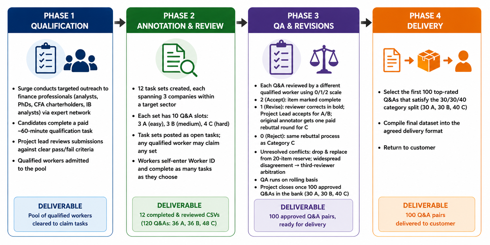

# Project Summary: SEC Filing Q&A Data Collection

**Date:** April 2026

---

A customer requested 100 Q&A pairs from SEC financial filings (10-K and 10-Q reports). Our job is to: (1) find expert annotators who know their way around a 10-K, (2) assign Q&A writing tasks across 12 pre-structured company sets, (3) have each submission reviewed by a different qualified worker, and (4) compile and deliver the best 100 to the customer. We collect up to 120 to maintain a buffer — contested or rejected Q&As can be dropped and replaced from the reserve without reopening collection.

**At a Glance:**

| | |
|--|--|
| Q&As delivered to customer | 100 |
| Q&As collected | 120 |
| Task sets | 12 (10 Q&As each) |
| Sectors covered | Technology (×3), Healthcare (×2), Energy (×2), Financials (×3), Industrials (×2) |
| Budget range | ~$3,335 (expected) — ~$3,865 (high), based on 120 Q&As collected |

---

## Phase 1 — Qualification

**Purpose:** Build a pool of workers who have experience working with 10-Ks and 10-Qs before any annotation begins.

**How it works:**
- Surge conducts targeted outreach to equity research analysts, finance PhDs, CFA charterholders, and former investment banking analysts through its expert network
- Each candidate completes a paid ~60-minute qualification task
- The project lead reviews all submissions against clear pass/fail criteria and admits qualified workers to the pool

**Key documents:** `1_annotator_qualification/`

**Deliverable:** A pool of qualified workers cleared to claim annotation and review tasks

---

## Phase 2 — Annotation & Review

**Purpose:** Collect 120 Q&A pairs from qualified workers across 12 pre-structured task sets.

**How it works:**
- We create 12 task sets, each spanning 3 companies within a target sector (Technology, Financials, etc.)
- Each set contains 10 Q&A slots: 3 Category A (easy), 3 Category B (medium), 4 Category C (hard)
- Task sets are posted as open tasks; any qualified worker may claim any set
- Workers self-enter their worker ID and complete as many tasks as they choose

**Key documents:** `2_data_collection/2.1_annotation_instructions.md`, `2_data_collection/2.2_review_instructions.md`, `3_annotator_data/`

**Deliverable:** 12 completed and reviewed task-set CSVs (120 Q&A pairs: 36 Category A, 36 Category B, 48 Category C)

---

## Phase 3 — QA & Revisions

**Purpose:** Ensure every Q&A that enters the final dataset is accurate and well-sourced.

**How it works:**
- Each submitted Q&A is reviewed by a different qualified worker using a 0/1/2 rating scale
- Rating 2 (Accept): item is marked complete
- Rating 1 (Revise): reviewer implements a correction in bold; project lead accepts for Category A/B; original annotator gets one paid rebuttal round for Category C
- Rating 0 (Reject): same rebuttal process as Category C
- Unresolved conflicts: contested item may be dropped and replaced from the 20-item reserve pool; widespread disagreement triggers a third-reviewer arbitration round
- QA runs on a rolling basis as submissions come in; the project closes once 100 approved Q&As are in the bank — 30 Category A, 30 Category B, and 40 Category C

**Key documents:** `4_quality_control/`

**Deliverable:** 100 approved Q&A pairs, ready for delivery

---

## Phase 4 — Delivery

**Purpose:** Compile and return the final dataset to the customer.

**How it works:**
- The first 100 top-rated Q&As that satisfy the 30/30/40 category split are selected from the approved pool
- Final dataset compiled into the agreed delivery format

**Deliverable:** 100 Q&A pairs delivered to customer

---

## Output Quantity

| Category | Description | Per set | Collected (12 sets) |
|----------|-------------|---------|---------------------|
| Category A | Easy, single-document | 3 | 36 |
| Category B | Medium, single-document | 3 | 36 |
| Category C | Hard, multi-document | 4 | 48 |
| **Total** | | **10** | **120 → deliver 100** |

---

## Budget

Workers self-report hours and are paid at $20/hour. Expected times per task are provided as guidance. The expected estimate uses those times as a baseline; the high estimate assumes workers take ~25% longer on average. Per-question bonuses are earned on top of base pay regardless of time taken — Category B annotation earns $2.50 per Q&A, Category C annotation earns $5.00 per Q&A, and Category C review earns $5.00 per review. Bonuses are flat and unaffected by pace.

**Annotation (120 Q&As):**

| Category | Count | Expected time | Base pay | Bonus | Total |
|----------|-------|---------------|----------|-------|-------|
| Category A | 36 | ~20 min each | ~$240 | — | ~$240 |
| Category B | 36 | ~25 min each | ~$300 | $2.50 × 36 = $90 | ~$390 |
| Category C | 48 | ~30 min each | ~$480 | $5.00 × 48 = $240 | ~$720 |
| **Annotation total** | | | **~$1,020** | **~$330** | **~$1,350** |

**Review (120 Q&As):**

| Category | Count | Expected time | Base pay | Bonus | Total |
|----------|-------|---------------|----------|-------|-------|
| Category A | 36 | ~15 min each | ~$180 | — | ~$180 |
| Category B | 36 | ~20 min each | ~$240 | $2.50 × 36 = $90 | ~$330 |
| Category C | 48 | ~25 min each | ~$400 | $5.00 × 48 = $240 | ~$640 |
| **Review total** | | | **~$820** | **~$330** | **~$1,150** |

**Full budget range:**

| Phase | Expected | High (+25% on base pay) |
|-------|----------|-------------------------|
| Qualification | ~$400 | ~$400 |
| Annotation | ~$1,350 | ~$1,605 |
| Review | ~$1,150 | ~$1,355 |
| **Subtotal** | **~$2,900** | **~$3,360** |
| +15% buffer | ~$435 | ~$505 |
| **Total** | **~$3,335** | **~$3,865** |

Qualification cost is fixed regardless of worker pace. The high estimate is the recommended planning figure.
