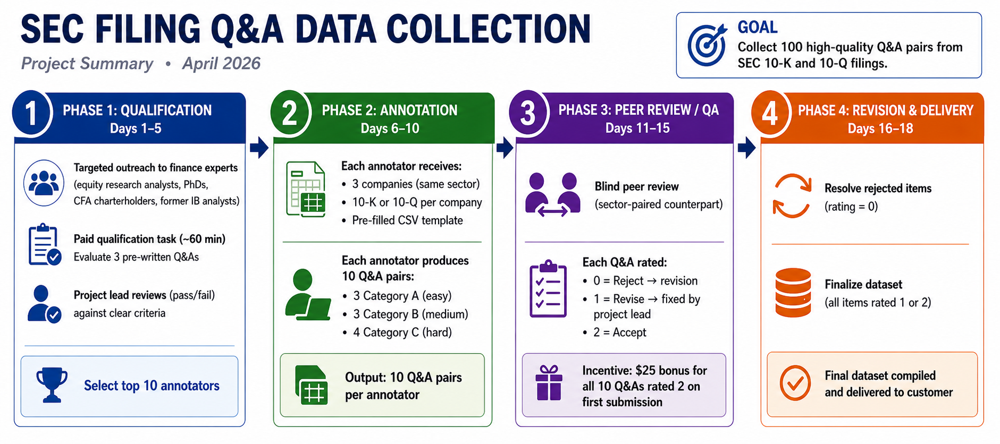

# Project Summary: SEC Filing Q&A Data Collection

**Date:** April 2026

---

A customer requested that we collect 100 Q&A pairs for SEC financial filings (10-K and 10-Q reports). This is a multi-step project — but have no fear! We'll walk through each step so the plan is easy to follow.

Here's the big picture: first, we need to find expert annotators who actually know their way around a 10-K. Once we identify candidates, we test their qualifications to make sure they have the chops to construct rigorous Q&A pairs (see: `1_annotator_qualification/`). Once our experts are selected, we hand them the financial documents they'll be working from and they get to writing (see: `2_data_collection/`). Annotator assignment sheets — pre-filled CSVs with each annotator's companies, filing metadata, and submission template — are distributed from `3_annotator_data/`. Annotators return their completed CSVs and downloaded PDFs to the same folder. After they submit their Q&As, we review everything for errors and accuracy before returning the final dataset to the customer (see: `4_quality_control/`). This document gives a high-level overview of each step.

---

## Structure

The client wants 100 Q&A pairs split into three categories — Category A, B, and C — which for simplicity we can think of as easy, medium, and hard respectively. Category A Q&As you can pull straight from the filing; Category B Q&As require a bit more digging (e.g., inferring something not directly stated); Category C Q&As require synthesizing information across multiple filings.

**How many annotators, and what do they produce?** We hire 10 annotators, each writing 10 Q&A pairs (3 Category A / 3 Category B / 4 Category C).

**Which financial documents do annotators use?** Each annotator is assigned 3 companies, randomly selected without replacement from one of 5 sectors (Technology, Healthcare, Energy, Financials, Industrials). They are provided a 10-K or 10-Q for each company; filing type per company is randomly assigned.

**Do we allow redundancy across annotators?** Yes — for each sector, 3 companies are randomly sampled from a pool of 5 and assigned to an annotator. Some company overlap between the two annotators in a sector is likely but not guaranteed.

---

## Output Quantity

| Category | Description | Per annotator | Total (10 annotators) |
|----------|-------------|---------------|-----------------------|
| Category A | Easy, single-document | 3 | 30 |
| Category B | Medium, single-document | 3 | 30 |
| Category C | Hard, multi-document | 4 | 40 |
| **Total** | | **10** | **100** |

---

## Annotator Tasks

Each annotator has two jobs — writing AND reviewing. Full details are in `2_data_collection/` and `4_quality_control/`.

- **Task 1:** Generate 10 Q&A pairs from assigned filings
- **Task 2:** Blind peer review of their sector-paired counterpart's 10 submissions

---

## Quality Assurance

We don't just trust the annotators blindly! Here's how we make sure the Q&As are actually good before they go to the customer.

- Blind peer review: each submission reviewed by the sector-paired annotator
- Rating scale: 0 (reject), 1 (revise), 2 (accept)
- Payment contingent on passing review; $25 bonus for all 2s on first submission

---

## Qualification

Not just anyone can do this — we need people who read 10-K/10-Qs for a living. Here's how we find and vet them. Full details in `1_annotator_qualification/`.

- Targeted outreach to equity research analysts, finance PhDs, CFA charterholders, and former investment banking analysts through Surge's expert network
- Paid ~60-minute qualification task; reviewed by project lead against clear pass/fail criteria

---

## Budget & Timeline

The bottom line — what this costs and how long it takes. Remaining work runs about 3 weeks from today, across four sequential phases.

**Total budget: ~$1,773 (including 15% buffer)**

| Phase | Cost |
|-------|------|
| Qualification | ~$400 |
| Data collection | ~$667 |
| Quality assurance | ~$475 |
| **Subtotal** | **~$1,542** |
| +15% buffer | $231 |
| **Suggested total** | **~$1,773** |

**How we get there:**

- **Qualification (~$400):** We recruit ~20 candidates and pay each $20 for a ~60-minute evaluation task.

- **Data collection (~$667):** Each annotator is expected to spend about 3 hours 20 minutes on their 10 Q&As: 15 minutes orienting on each of their 3 documents, then 10 / 15 / 20 minutes per Category A / B / C question respectively. At $20/hour across 10 annotators, that's ~$667. If an annotator needs more time, they must submit a written note with their CSV specifying exactly what took longer and why. These claims will be reviewed.

- **Quality assurance (~$475):** Peer review (Task 2) runs ~1.75 hours per annotator at $20/hour — $350 total. Reviewers are evaluating Q&As directly, not re-reading source documents. The time estimate breaks down as: 5 / 10 / 15 minutes per Category A / B / C Q&A reviewed (3 + 3 + 4 = 105 min = ~1.75 hours). Performance bonuses ($25 per annotator for all 10 Q&As rated 2 on first submission, estimated ~50% of annotators) add up to ~$125 (5 annotators × $25).

---

## Timeline

| Phase | Days | Description |
|-------|------|-------------|
| Phase 1 — Qualification | Days 1–5 | Surge conducts targeted outreach to finance experts. Candidates complete a paid ~60-minute qualification task (evaluating 3 pre-written Q&As). The project lead reviews all submissions and selects the top 10 annotators. |
| Phase 2 — Annotation | Days 6–10 | Qualified annotators receive their assignment CSVs and task instructions. They work asynchronously to produce 10 Q&A pairs each over 5 business days. A reminder email is sent at the midpoint (Day 8) to annotators who have not yet submitted, and again on the final day (Day 10). See `2.3_email_reminders.md` for draft emails. |
| Phase 3 — Peer review / QA | Days 11–15 | Each annotator blind-reviews their sector-paired counterpart's 10 submissions over 5 business days. Ratings of 0 trigger revision requests back to the original annotator; ratings of 1 are corrected by the project lead. |
| Phase 4 — Revisions & delivery | Days 16–18 | Any revised submissions are reviewed and finalized. Dataset is compiled and returned to the customer. |

