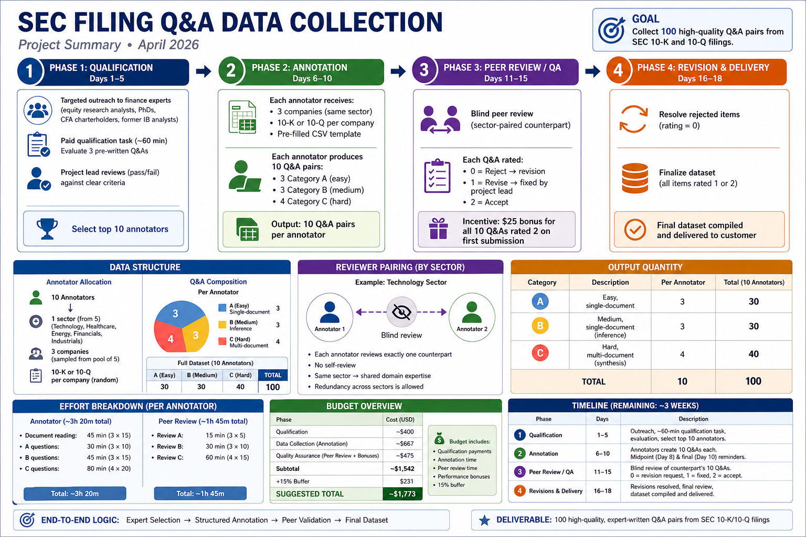

# SEC Filing Q&A Data Collection — Mini Project Submission

**Submitted by:** Isaac Christian
**Date:** April 2026

---

Hey! Welcome, and thanks for taking a look at this submission. What you have in front of you is a full project plan for collecting 100 Q&A pairs from SEC financial filings (10-K and 10-Q reports) — designed to be handed off to a real team and run end-to-end.

The project is organized into four subdirectories, each covering a distinct phase. Here's a quick map so you know exactly where to find everything:

---

## 0_project_summary.md

Start here! This is the top-level overview of the entire project.

---

## 1_annotator_qualification/

Everything about finding and vetting expert annotators before they touch a single filing.

- **1_qualification_project.md** — The internal project doc. Covers who we're recruiting (equity analysts, finance PhDs, CFA charterholders, etc.), how the qualification task works, the three pre-written Q&As candidates are asked to evaluate, the pass criteria, and the qualification budget. Intended for the project lead.

- **1.1_qual_candidate_instructions.md** — The document sent directly to candidates. Has the rating scale, task instructions, and the three Q&As — ready to send as-is. No internal notes or expected answers included.

---

## 2_data_collection/

Everything about the actual data collection: which companies annotators work from, how they're assigned, what they're expected to produce, and how to access the filings.

- **2_data_collection.md** — The internal project doc. Covers sector and company selection, the annotator assignment logic (including the full assignment table showing which companies each annotator receives), workflow, the data output schema with a sample record, and the data collection budget.

- **2.1_worker_facing_instructions.md** — The document sent directly to annotators. Walks through how to download their assigned filings from SEC EDGAR, how to write Easy / Medium / Hard Q&As with the correct Supporting Facts sections, quality standards, and the peer review task. Ready to send alongside their assignment CSV.

- **2.2_reviewer_facing_all_companies.csv** — The full list of 40 candidate companies across all sectors, with filing type, filing date, and SEC search link for each. Used as the source pool for company selection and distributed to annotators for reference when writing Category C (cross-document) questions.

---

## 3_annotator_data/

The actual assignment packets — one CSV per annotator, ready to distribute. Each file is pre-filled with the annotator's ID, sector, assigned companies, filing metadata (type, date, SEC search URL, suggested PDF filename), and question category labels. Annotators fill in the question, answer, additional info, and confirmed PDF filename, then return the completed CSV along with their downloaded PDFs.

| File | Annotator | Sector |
|------|-----------|--------|
| A01_technology.csv | A01 | Technology |
| A02_healthcare.csv | A02 | Healthcare |
| A03_energy.csv | A03 | Energy |
| A04_financials.csv | A04 | Financials |
| A05_industrials.csv | A05 | Industrials |
| A06_technology.csv | A06 | Technology |
| A07_healthcare.csv | A07 | Healthcare |
| A08_energy.csv | A08 | Energy |
| A09_financials.csv | A09 | Financials |
| A10_industrials.csv | A10 | Industrials |

---

## 4_quality_control/

Everything about making sure the Q&As are actually good before they go to the customer.

- **4_quality_assurance.md** — The internal QA doc. Describes the blind peer review structure, reviewer assignments by sector pair, the 0/1/2 rating scale, what happens at each rating outcome, reviewer criteria, the performance bonus, and the full project budget summary across all three phases.

---

Happy reading — thank you (or your AI bot) for taking the time!
